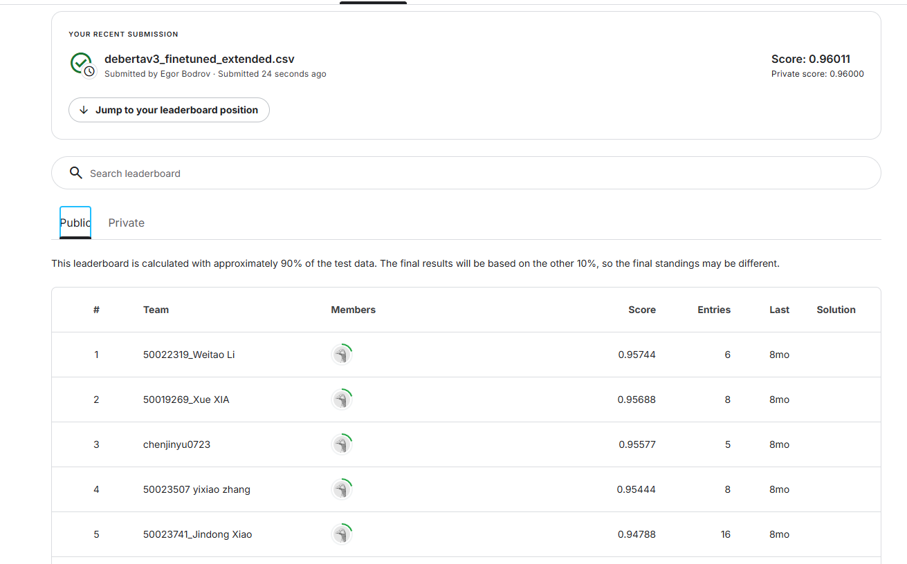
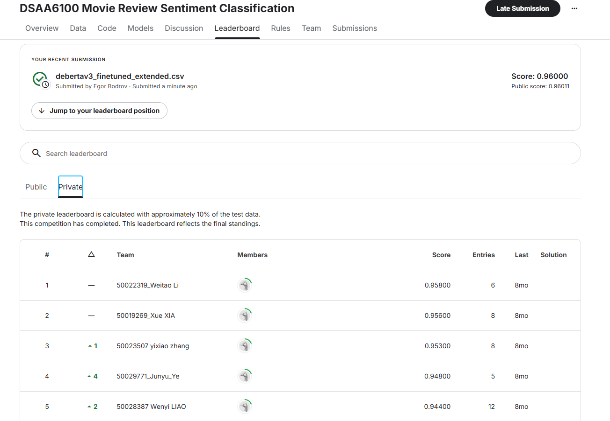

# Movie Review Sentiment Classification

Overleaf paper: https://www.overleaf.com/read/xsvjdmynqmdq#830f84

Or see [this document](./images/Movie_Review_Report.pdf)

May 2025

## Abstract

This project addresses the problem of automatic sentiment classification of movie reviews using modern NLP models. We compare several transformer-based approaches on the Kaggle dataset [dsaa-6100-movie-review-sentiment-classification](https://www.kaggle.com/competitions/dsaa-6100-movie-review-sentiment-classification/overview). The goal is to achieve high accuracy in binary sentiment classification (positive/negative) and analyze the impact of model choice and preprocessing.


## 1 Introduction
Sentiment analysis of movie reviews is a classic NLP task with practical applications in recommendation systems, social media monitoring, and customer feedback analysis. The challenge lies in handling informal language, sarcasm, and short texts. We focus on leveraging recent advances in transformer architectures (DistilBERT, DeBERTa v3) and compare their performance on a real-world dataset.

### 1.1 Team
`Egor Bodrov`

- Exploratary Data Analysis
- Research for baseline models
- Training architectures on dataset
- Writing the report
- Implementation of data annotation approach

`Gleb Onore`
- Submitting to competition
- Building hyphotesis
- Research for baseline models
- Training architectures on dataset
- Hyperparameters selection
- Writing the report

`Evgeniy Dubskiy`
- Research for baseline models
- Training architectures on dataset
- Writing the report
- Competition research


## 2 Related Work

- [Sentiment Analysis of Movie Reviews: A New Feature Selection Method](https://hcis-journal.springeropen.com/articles/10.1186/s13673-018-0135-8)

This paper proposes a novel hybrid feature selection method for sentiment analysis of movie reviews, combining statistical approaches (like chi-square) with semantic similarity (WordNet-based). The method aims to enhance classification accuracy by selecting more informative and sentiment-relevant features, and it shows improved performance over traditional approaches on standard movie review datasets.


- [Sentiment Analysis of Movie Reviews Using BERT](https://arxiv.org/abs/2502.18841)

This paper fine‑tunes BERT (plus Bi‑LSTM) on standard movie‑review datasets for binary classification. The model achieves SOTA accuracy and also proposes a heuristic to compute overall sentiment polarity across multiple reviews


- [A Comparative Analysis of Transformer-Based Models for Sentiment Classification](https://arxiv.org/abs/2206.12377)

This paper evaluates multiple transformer models — including BERT, RoBERTa, ELECTRA, and others — on various sentiment analysis datasets. The study highlights model performance trade-offs, showing that RoBERTa and DeBERTa often outperform BERT in both accuracy and robustness.


- [Fine-Tuning Pre-trained Transformers for Sentiment Analysis](https://aclanthology.org/2021.naacl-main.373/)

The study investigates how fine-tuning pre-trained transformer models (BERT, RoBERTa, ELECTRA) affects sentiment classification. It emphasizes the importance of task-specific adaptation and demonstrates that careful fine-tuning can close the gap between lighter and heavier models.


- [Distilled Transformers for Sentiment Classification on Resource-Constrained Devices](https://arxiv.org/abs/2010.14448)

This paper explores the use of distilled transformer models like MobileBERT and TinyBERT for efficient sentiment classification. It compares their trade-offs in latency, size, and accuracy, offering insights into deploying NLP models in real-time or embedded environments.


## 3 Model Description

Our final solution is based on the **DeBERTaV3** architecture fine-tuned for sentiment classification. **DeBERTaV3** improves upon earlier transformer models by incorporating **disentangled attention mechanisms** and **enhanced position encodings**, allowing for better semantic representation of natural language inputs, especially in complex or nuanced sentiment tasks such as movie or game reviews.

We utilize the AutoTokenizer and AutoModelForSequenceClassification classes from the HuggingFace Transformers library. The tokenizer is responsible for converting raw input text into token IDs understandable by the model. It also manages truncation and subword tokenization.

We use the pretrained DeBERTaV3 tokenizer to split and encode sentences while maintaining semantic boundaries.
**AutoModelForSequenceClassification** wraps DeBERTaV3 with a classification head — a feedforward layer mapping the [CLS] token output to sentiment classes
We minimize the cross-entropy loss between predicted class distributions and true labels:

$$
\mathcal{L} = -\sum_{i=1}^{C} y_i \log(\hat{y}_i)\,,
$$

$$
\begin{aligned}
\mathcal{L} &\text{ — loss function} \\
C &\text{ — Number of classes} \\
y_i &\in \{0, 1\}, \text{ True label (one-hot)} \\
\hat{y}_i &\in [0, 1], \text{ Predicted prob } \\
\log(\hat{y}_i) &\text{ — Log of predicted prob }
\end{aligned}
$$

At the heart of the DeBERTaV3 model lies the Scaled Dot-Product Attention mechanism:
$$
\text{Attention}(Q, K, V) = \text{softmax} \left( \frac{QK^\top}{\sqrt{d_k}} \right) V\,.
$$

$$
\begin{aligned}
Q &\in \mathbb{R}^{n \times d_k} \quad \text{— query matrix} \\
K &\in \mathbb{R}^{n \times d_k} \quad \text{— key matrix} \\
V &\in \mathbb{R}^{n \times d_v} \quad \text{— value matrix} \\
\sqrt{d_k} &\text{ — scaling factor (dimension of keys)} \\
\text{softmax} &\text{ — converts scores into probabilities}
\end{aligned}
$$

DeBERTaV3’s disentangled attention decouples content and positional information, improving the model's ability to generalize across varied review structures and languages.


## 4 Dataset

### 4.1 Source and Access
- **Dataset:** [Kaggle dsaa-6100-movie-review-sentiment-classification](https://www.kaggle.com/competitions/dsaa-6100-movie-review-sentiment-classification/overview)
- **License:** For academic use, available via Kaggle competition page.
- **Files:**
  - `movie_reviews.csv` (train): columns `Id`, `text`, `label` (0=negative, 1=positive)
  - `test_data.csv` (test): columns `Id`, `text`

### 4.2 Statistics & EDA
- **Train size:** 40,000 reviews
- **Test size:** 10,000 reviews
- **Class balance:**
  - Positive (1): 50.1%
  - Negative (0): 49.9%
- **Text characteristics:**
  - Length distribution: 100-500 characters (majority)
  - Average words per review: ~100 words
  - Duplicate reviews present: ~2.5% of total reviews
- See `experiments/EDA.ipynb` for detailed visualizations:
  - Class distribution plots
  - Text length histograms
  - Word clouds for frequent terms
  - Comparison of positive vs negative review lengths


### 4.3 Data annotation

Our team implemented a LLM-agent for enriching data samples based on training dataset for creating 
additional examples of data, extended dataset size was expanded with 1000 samples per each class. All
generated samples are different from each other.

The final solution performed by model trained on extended dataset.

*See more on how to use it in project setup section*

## 5 Experiments

### 5.1 Metrics
- **Primary metric:** Accuracy
- **Rationale:** Dataset is balanced, accuracy is the competition metric

### 5.2 Experiment Setup
- **Data split:** 90% train / 10% validation (stratified)
- **Training parameters:**
  - Batch size: 16
  - Max sequence length: 256 tokens
  - Optimizer: AdamW (lr=2e-5)
  - Epochs: 3-4 with early stopping
  - Loss: Cross-entropy
- **Hardware:** GPU (CUDA if available)
- **Model selection:** Best checkpoint by validation accuracy

### 5.3 Experiments
1. **Zero-shot Baselines**
   - DistilBERT (no fine-tuning): `sarahai/movie-sentiment-analysis`
   - DistilBERT SST-2: Pre-trained on Stanford Sentiment Treebank
   - DistilBERT Amazon: Pre-trained on Amazon reviews

2. **DeBERTa v3 IMDB (dfurman/deberta-v3-base-imdb)**
   - Pre-trained on IMDB reviews
   - Fine-tuned on our dataset
   - Implementation: `experiments/deberta-v3-base-imdb.ipynb`

3. **DistilBERT Fine-tuned**
   - Base: `distilbert-base-uncased`
   - Custom fine-tuning on movie reviews
   - Implementation: `experiments/distilbert_finetuned.ipynb`

4. **AlBert Fine-tuned**
  - Base: `albert-base-v2`
  - Custom fine-tuning on movie reviews
  - Implementation: `experiments/albert-finetuned.ipynb`

5. **XLM Roberta Fine-tuned**
  - Base: `xlm-roberta-base`
  - Custom fine-tuning on movie reviews
  - Implementation: `experiments/xml-bert-finetuned.ipynb`

6. **DeBertaV3 pretain on IMDB**
  - Base: `dfurman/deberta-v3-base-imdb`
  - Custom fine-tuning on movie reviews
  - Implementation: `experiments/deberta-v3-base-imdb.ipynb`

7. **ELECTRA Fine-tuned**
  - Base: `google/electra-base-discriminator`
  - Custom fine-tuning on movie reviews
  - Implementation: `experiments/electra-finetuned.ipynb`

8. **MobileBert Fine-tuned**
  - Base: `nreimers/MiniLM-L6-H384-uncased`
  - Custom fine-tuning on movie reviews
  - Implementation: `experiments/mobile-bert-finetuned.ipynb`


## 6 Results

| Model                              | Validation Accuracy |  Responsible |
|-------------------------------------|--------------------|--------------|
| DistilBERT (pretrained, no FT)      | ~0.85              |    Egor B.   |
| DistilBERT (fine-tuned)             | ~0.89              |    Egor B.   |
| DistilBERT (SST-2, zero-shot)       | ~0.83              |    Egor B.   |
| DistilBERT (Amazon, zero-shot)      | ~0.81              |    Gleb O.   |
| DeBERTa v3 (fine-tuned, IMDB)       | ~0.90              |    Gleb O.   |
| DeBERTa v3 (fine-tuned, base)       | ~0.89              |    Gleb O.   |
| XLM (fine-tuned, base)              | ~0.92              |    Egor B.   |
| AlBert (fine-tuned, base)           | ~0.80              |   Evgeniy D. |
| ELECTRA (fine-tuned, base)          | ~0.89              |   Evgeniy D. |
| MobileBERT (fine-tuned, base)       | ~0.55              |   Evgeniy D. |

*See experiment notebooks for detailed logs and plots.*

## 7 Report Conclusion
We compared several transformer-based models for movie review sentiment classification. Fine-tuned DeBERTa v3 on extended dataset performed the best results on competition.

**Public results on leaderboard**


**Private results on leaderboard**


We developed a LLM-annotator and enriched data that increases Kaggle Competition result accuracy score by ~1,5%.


# Project guide

## Project structure
```plain
.
├── README.md                # Report + instructions
├── .env.template            # Template of env variables
├── poetry.lock              # Poetry dependencies versions config
├── pyproject.toml           # Poetry config
├── experiments/             # Experiments
├── src/                     
│   └── scripts/  
|       └── synthetic_data_annotator.py # Annotation script
|   └── models/
|       └── debertaV3.py     # Solution interface

```

## Installation

Create any environment for Python development (optional)
```shell
conda create -n <name_of_env> python=3.12 -y
conda activate <name_of_env>
```

Install poetry and all dependencies
```shell
pip install poetry==1.8.4
poetry install --all-extras
```

Setup API KEYS for LLM in .env file, according to .env.template
```shell
OPENAI_API_KEY="<YOUR API KEY>"
OPENAI_BASE_URL="<YOUR BASE URL>"
```

## Scripts

1. `Synthetic Data Annotation`

Prerequisites:
- All dependencies are installed
- **.env** file is ready with your API KEYS
- You downloaded the data from source

Running the script:
```shell
python src/scripts/synthetic_data_annotator.py \
  --samples <num_of_samples_to_generate>
  --output_file <path_to_save_the_result>
```

2. `Inference Interface`

Prerequisites:
- All dependencies are installed

Example of usage:
```shell
from src.models import DebertaV3

model = DebertaV3(model_path=<path_to_model>, device=<your_device_num>)
results = model.predict(text=<text_to_classify>)
```
