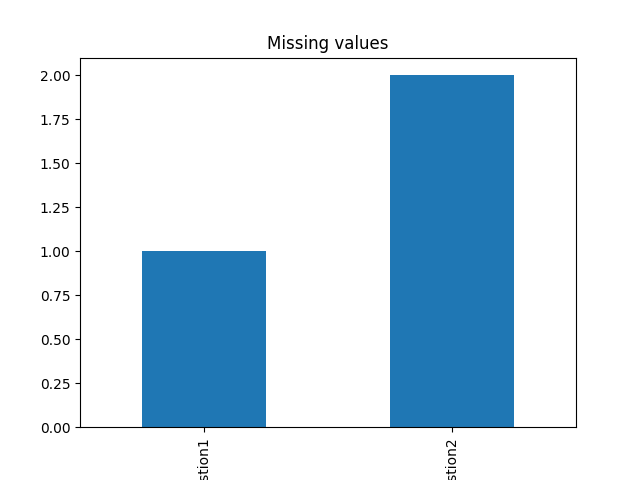
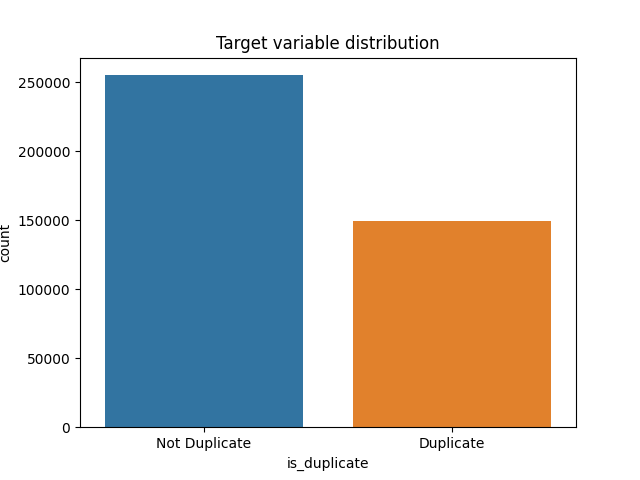
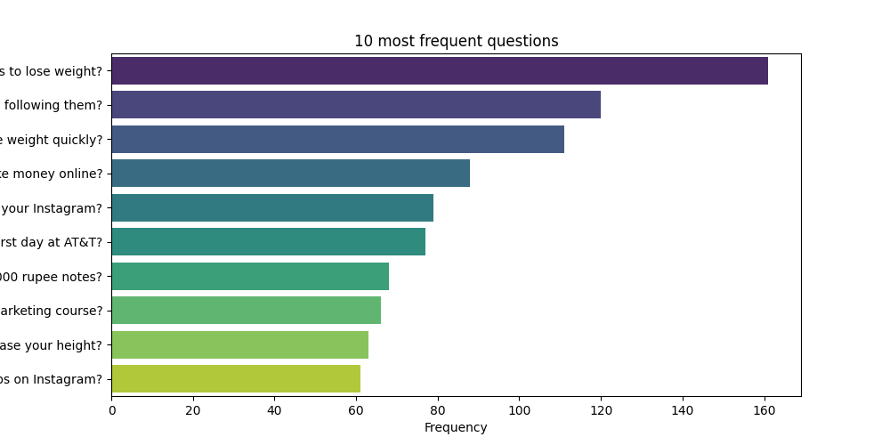
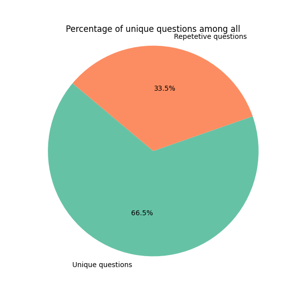
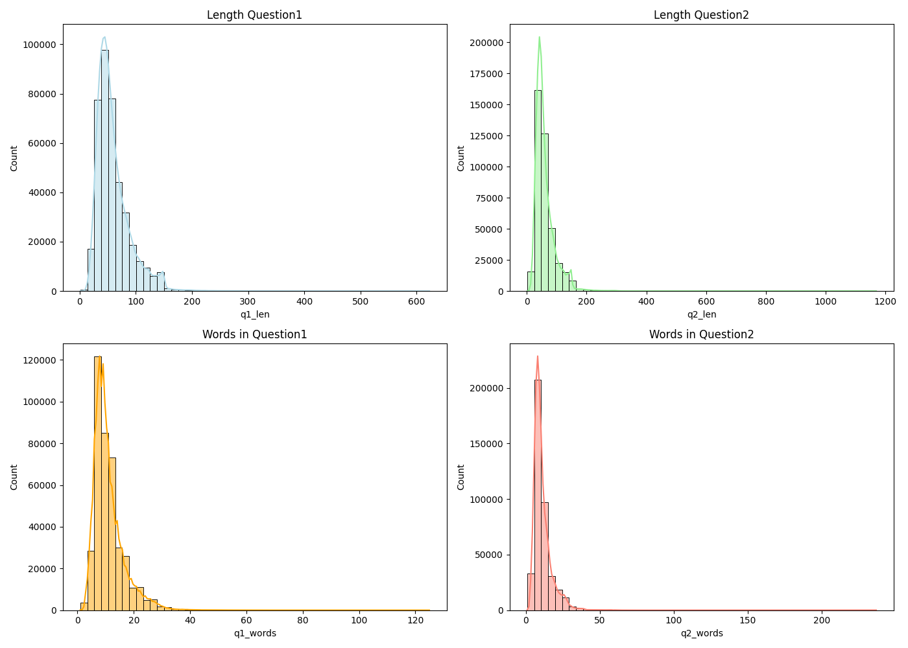
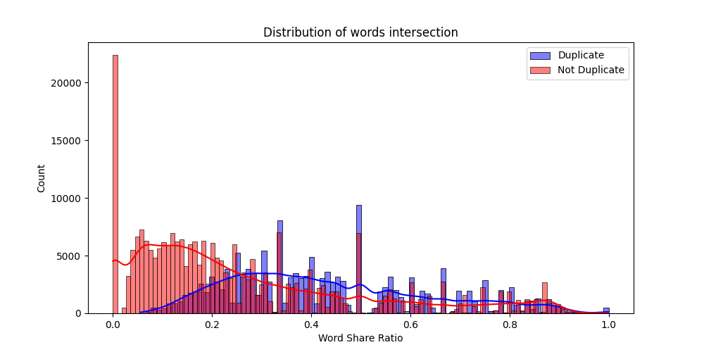
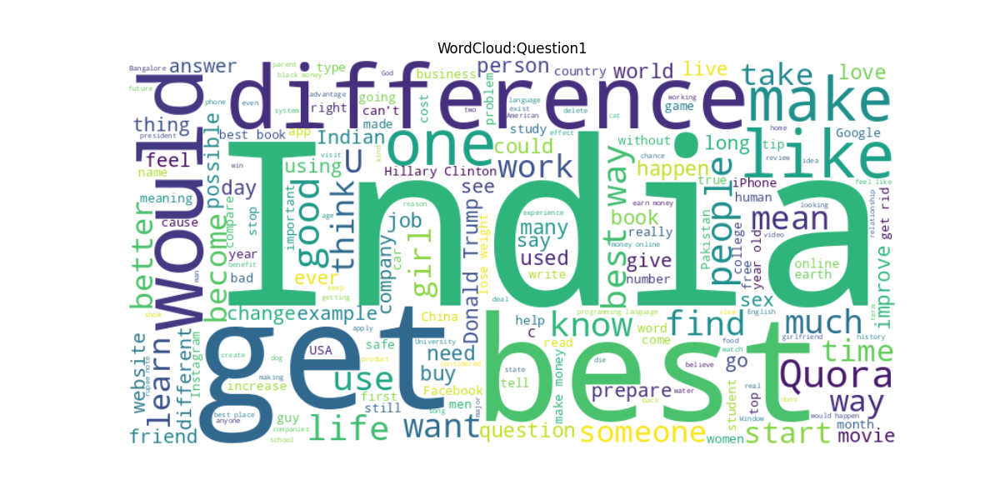
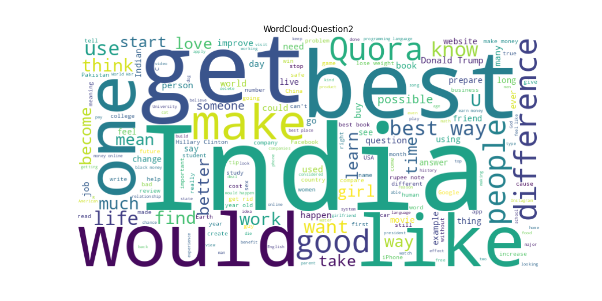

# Quora Question Pairs competition

May 2025

Abstract

This document will provide you with guidelines for your project final
report. You will learn how to structure the report and present your results.
Use this field for the short description of your work. Please provide a
link to your project code right here: https://github.com/EgorBodrov/ods-nlp.git

# 1 Introduction
TODO

## 1.1 Team
`Egor Bodrov`:
- TODO

`Gleb Onore`:
- TODO

`Evgeniy Dubskiy`:
- TODO

# 2 Related Work
TODO

# 3 Model Description
TODO

# 4 Dataset

Вот аккуратно оформленный Markdown `.md` вариант описания датасета **RCV1**, аналогичный по стилю твоему примеру с PAWS:

---

## 4 Dataset

### Gather data

In this work, we use the Quora Question Pairs dataset, originally released by Quora and presented through the [Kaggle competition](https://www.kaggle.com/competitions/quora-question-pairs/overview).

---

### Dataset format

The dataset consists of over 400,000 question pairs with the following columns:

- id: Unique identifier for the question pair.

- qid1, qid2: Unique IDs for each individual question.

- question1, question2: The actual text of the questions.

- is_duplicate: Binary label (1 if the questions are semantically equivalent, 0 otherwise).

---

### Dataset statistics

| Split                  | Number of Pairs  | % Duplicate | % Non-Duplicate |
| ---------------------- | ---------------- | ----------- | --------------- |
| Training               | 404,287          | 36.9%       | 63.1%           |
| Testing                | 3,563,475        | —           | —               |

### Exploratory Data Analisys

---

### Dataset Quality

- Class Imbalance

The dataset is imbalanced: about 63% of question pairs are not duplicates, and 37% are duplicates.

This needs to be addressed during model training (e.g., with class weighting or resampling).

- Repetition of Questions

Many questions appear multiple times across different pairs.

A large portion of question pairs include frequently asked or popular questions, making some duplicates easier to detect.

- Text Length Distribution

Most questions are between 40–100 characters long.

The number of words per question typically ranges from 5 to 15 words.

Length distributions for question1 and question2 are very similar, which supports the dataset balance in terms of textual complexity.

- Word Overlap Between Pairs

Duplicate questions tend to have a higher word overlap ratio than non-duplicates.

This suggests that shared vocabulary is a useful signal for detecting duplicates.

- Word Clouds

Common words include generic interrogative terms like: what, how, do, is, etc.

- Unique vs. Repeated Questions

Only about 60–70% of all questions are unique; the rest are repeated in different pairs.

This reinforces the idea that the dataset contains many reformulations of similar questions.

# 5 Experiments

## 5.1 Metrics
TODO

## 5.2 Experiment Setup
TODO

## 5.3 Baselines
TODO

# 6 Results
TODO

# 7 Conclusion
TODO